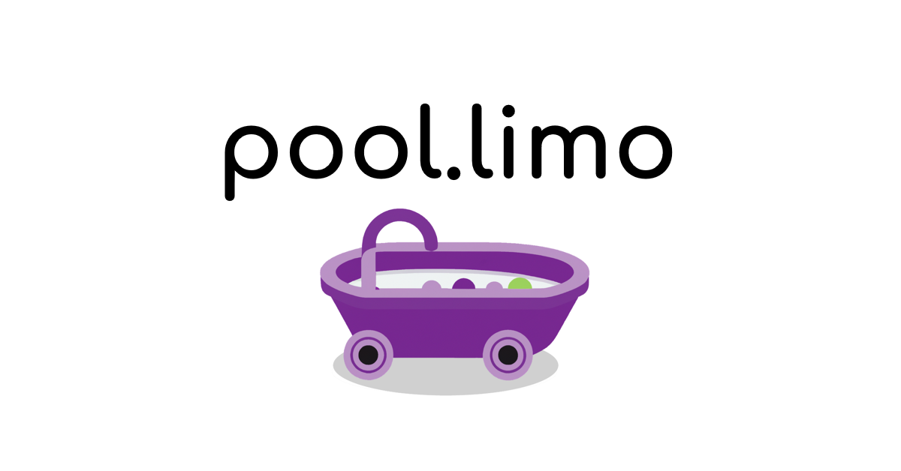

## About

`pool.limo` is a gateway service to serve decentralized websites managed by a `.pool` domain. You can learn more about `.pool` domains at [names.pooly.me](https://names.pooly.me/).

## Limitations

`pool.limo` is inspired by ENS gateways like [eth.limo](https://eth.limo). However, pool.limo takes a different approach to bring operational costs to a minimum. If you're used to using `eth.limo`, here are some of the differences to expect:

|                    | pool.limo          | eth.limo           |
|--------------------|--------------------|--------------------|
| Hosting            | static             | server/cloud       |
| Name Resolution    | client-side        | server-side        |
| Content Resolution | IPFS               | IPFS/IPNS/Skeynet  |
| SEO Optimized      | none               | partial            |
| Requires JavaScript| yes                | no                 |
| Service Workers    | partial support    | full support       |

*If there is more demand (and funding) for the advanced features that other gateways offer, they may be added to the pool.limo service in the future.*

## Summary

`pool.limo` is a great service for serving simple decentralized content **FOR FREE** through your `.pool` name, but is not designed for production-grade applications.

# How to Host a Website with pool.limo

## Step 1: Buy a `.pool` domain

- Go to [names.pooly.me](https://names.pooly.me/) and purchase a new name if you don't already have one.

## Step 2: Create a decentralized website

- Create a static website and pin the files to your local IPFS node or on a pinning service like [pinata](https://pinata.cloud).

- If you don't know how to code a static website, you can start by copying and pasting this template into a text editor and saving the file as `index.html`:

```html
<!DOCTYPE html>
<html>
  <head>
    <title>Page Title</title>
  </head>
  <body>
    <h1>This is a Heading</h1>
    <p>This is a paragraph.</p>
  </body>
</html>
```

- You can edit the text that is in-between the tags. Example:
```html
<some-tag>Your text here.</some-tag>
```

- While editing, you can view your changes by opening the `index.html` file with your browser
- Once you are done editing the file, pin it to IPFS.

## Step 3: Set a `content` field on your domain

- After pinning your site to IPFS, copy the IPFS CID of your site and go to [names.pooly.me](https://names.pooly.me/).

- Go to your profile, and click `"Edit domain data"` next to the domain that you want to use.

- Click `"Edit data"` and then click `"Add new field"`. Set the key to `"content"` and the value to `"ipfs://<Your CID>"`.

- Your new field should look similar to this:

  `content` -> `ipfs://bafybeicc4mbqa6gi5i3jmmvmf4g56x2z6wjp3tqeos67ity2bjraedk3km`

- Click `"Submit"` to update your domain information with the new content field. The site will prompt you to sign a transaction to complete this step.

## Step 4: View your site!

- Go to `<your name>.pool.limo` to view your new decentralized `.pool` site!
- You can update your site at any time by pinning your new site files to IPFS and updating the content CID of your domain.